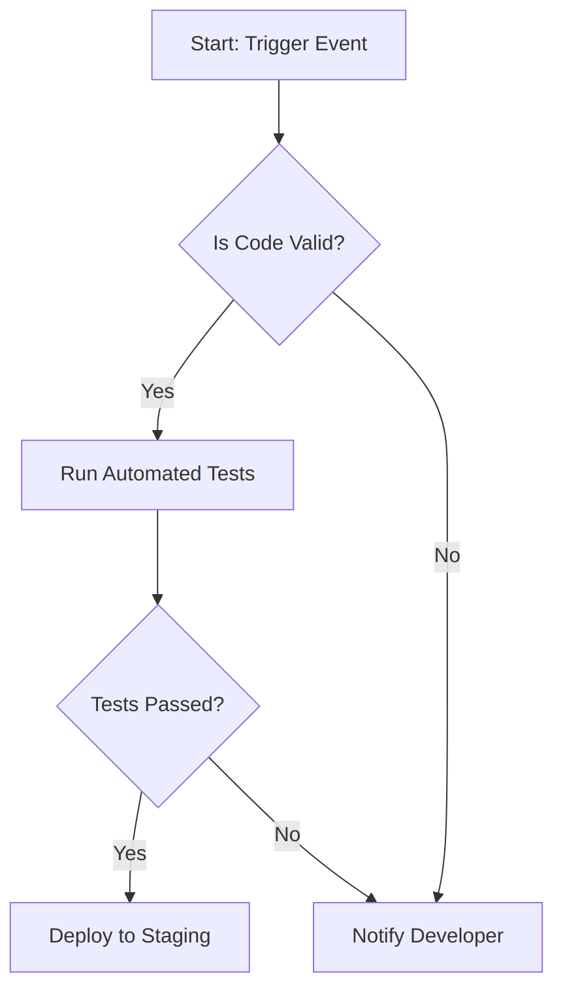

# JPcodingsessions

```mermaid
graph TD
    A[Start: Trigger Event] --> B{Is Code Valid?}
    
    %% Branch 1: Pass
    B -->|Yes| C[Run Automated Tests]
    C --> D{Tests Passed?}
    D -->|Yes| E[Deploy to Staging]
    D -->|No| F[Notify Developer]
    
    %% Branch 2: Fail
    B -->|No| F
```
